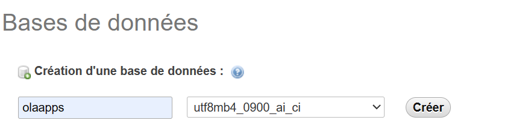

# OlaApps : C'est le nom de notre application et elle permet de 
 Gérer le stock d'une station service

# Installation et configuration de l'environnement de developpement

* Vous devez installer tous les fichiers VC++ (2010 - 2022) x64 et x86 :
    https://learn.microsoft.com/en-us/cpp/windows/latest-supported-vc-redist?view=msvc-170

* Vous devez par la suite telecharger et installer WampServer Pour le server locale :
    https://phpsources.net/phpsources.net_WAMP-3.2.0-64-bits-x64_76-29.zip

* Vous devez par la suite installer Composer dans votre systeme :
    https://getcomposer.org/Composer-Setup.exe
    Lors de l'installation vous devez choisir php 8.0.* pour que le projet puisse fonctionner normalement

* Vous devez telecharger et installer NodeJS : 
    https://nodejs.org/dist/v20.12.2/node-v20.12.2-x64.msi

* vous devez installer Visual studio code si vous ne l'avez pas au prealable
    https://code.visualstudio.com/Download

* vous allez demarrer votre wampserver puis creer une base de donnees appelee "olaapps"  

* Vous allez maintenant ouvrir le projet dans visual studio code pour la configuration de l'environnement
    * Ouvrez votre terminal et entrer ses commandes une par une
        * php artisan migrate : Pour faire les migrations des tables
        * php artisan db:seed --class=Databaseseeder : Pour creer les roles et les differents comptes
        * npm install : Pour installer les dependances du projet
        * php artisan serve : Pour demarrer et executer le projet 
        
* Identifiants pour se connecter au projet
    'email' => 'admin@admin.com',
    'password' => '12345678'

